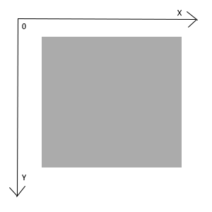

# Checkpoint

## Game 
This is a single player game where the goal is to find the (shortest) path to a labyrinth's exit.

## Solution

There is always going to be a solution for every labyrinth. This solution is going to be the smallest sequence of moves for the path to the exit. This sequence needs to be repeated until the robot reaches the goal.

## References

## Problem formulation 

### State Representation
- (x,y) - Represents the user current position
- place(x,y) - Represents what is in (x,y)
- if place(x,y) == 0 then (x,y) is free
- if place(x,y) == 1 then a wall occupies (x,y)
- if place(x,y) == 2 then (x,y) is the exit
- We are representing the labyrinth's dimensions as xSize and ySize.
- Consider the xy axis has its origin in the superior left corner, like this:

    

### Initial state

Can be any (x,y), usually in one of the corners of the labyrinth.
We are considering it's (0,0), for example.

### Objective test

Any (x,y) and place(x,y) = 2.

### Operators (Name, Preconditions, Effect, Cost)

| Name  | Preconditions             | Effect    | Cost |
| ----- | ------------------------- | --------- | ---- |
| UP    | y>0 & place(x,y)!=1       | y = y-1   |  1   | 
| DOWN  | y<ySize & place(x,y)!=1   | y = y+1   |  1   |
| LEFT  | x>0 & place(x,y)!=1       | x = x-1   |  1   |
| RIGHT | x<xSize & place(x,y)!=1   | x = x+1   |  1   |

### Heuristic function

#### Greedy -- Manhattan Distance
h(n) = |n.x - f.x| + |n.y - f.y| #f being the final coordinate

## Programming language

We are using **Python** for this project. The main reason being it is a high level language with many libraries for AI & ML which will not only save as time but also allows to create a better and more efficient program.

## Data structures to be used
For our game,  only the maze and the current position of the robot are needed
### Maze
2-D array (ex:[[1,1,1,1,1],
        [1,0,0,0,1],
        [1,0,1,0,1],
        [1,0,1,0,1],
        [1,0,0,2,1],
        [1,1,1,1,1]])
### Robot Position
List of two elements (ex: [x,y])